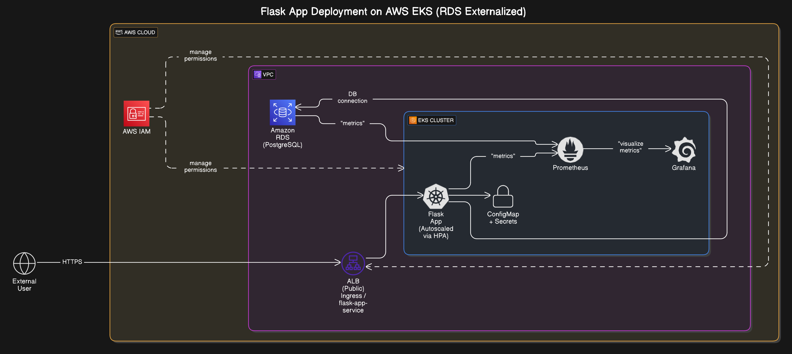
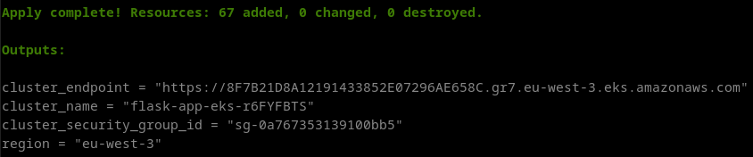

# Modifications et recommandations


[](https://codecov.io/gh/cecilegltslmcs/testing-repository-simple-python)

Ce document récapitule les modifications apportées au projet de base pour le rendre plus robuste, scalable, observable et prêt à être déployé dans un environnement de production sur AWS.

## Généralités

- Mise en place d'une intégration continue via GitHub Actions.
- Mise à jour de la configuration `pre-commit` :
    - Remplacement de *flake8* et *black* par **Ruff**.
    - Ajout de hooks basiques : `check-yaml`, `check-docstring`, `end-of-file-fixer`, etc.
- Upgrade de Python vers la version 3.12.10 afin de corriger plusieurs vulnérabilités connues (ex : CVE-2023-40217, CVE-2023-6597), renforçant la sécurité du runtime pour les environnements de production.

## Application

- Mise en place de `python-dotenv` dans `requirements-dev.txt` pour la gestion des variables d'environnement via un fichier `.env`.
- Mise en place des routes `/healthz` et `/readyz` pour l’intégration dans des probes Kubernetes (cf. [`health.py`](src/routes/health.py)).
- Mise en place de Gunicorn (présent dans `requirements.txt`) pour un usage en production.
- Mise en place de tests unitaires sur le script `health.py` à titre de démonstration (cf. [`test_health.py`](tests/test_health.py)).

### Lancement de l'application avec Gunicorn

- Mise en place d'un serveur WSGI pour l'exécution en production. 

```bash
gunicorn -w 4 -b 0.0.0.0:8888 src:application
```

### Suggestions complémentaires

- Migration vers FastAPI pour une gestion optimisée de l’asynchrone.
- Ajout de documentation technique, notamment via des docstrings standardisées.
- Utilisation de __uv__ pour accélérer la gestion des environnements et ajouter un verrouillage de version via `requirements.lock`.
- Connexion à une base de données PostgreSQL (ex. AWS RDS) en remplacement de data.json, pour assurer la persistance multi-instance et un accès concurrent fiable.

## Déploiement

- Mise en place d’un __Dockerfile__ optimisé.
- Workflow GitHub Actions de build et de publication de l’image sur GHCR.
- Scan de sécurité de l’image Docker via __Trivy__.

### Déploiement Kubernetes local (K3d)

- Déploiement local orchestré via les manifests Kubernetes présents dans `kube_config/` :
```bash
kubectl apply -f kube_config/
```
Contenu :
    - _config-map.yaml_ : Contient les variables d'environnement pour la base de données. Pourra être modifié en secrets si besoin de cacher des mots de passe ou d'autres informations sensibles
    - _deployment.yaml_ : Informations du déploiement en lien avec l'application
    - _hpa.yaml_ : Gestion de la montée en charge en se basant sur les ressources liées au CPU
    - _ingress.yaml_ : Permet d'accéder à l'API à travers un reverse proxy propre à Kubernetes
    - _service.yaml_ : Permet d'exposer le déploiement.
Tous les fichiers mentionnés sont disponibles dans [`kube_config/`](kube_config/).

- Mise en place d’un workflow de déploiement local dans K3d, avec vérification automatique de l’endpoint `/readyz` via un _port-forward_ dans la pipeline CI.
- Mise en place d'un scan de sécurité du cluster après déploiement avec __Kubescape__.

### Suggestions complémentaires

- Migration vers __Helm__ pour plus de souplesse (templating, gestion des versions).
- Adoption de __Kustomize__ pour gérer les overlays (dev, staging, prod).
- Passage à une logique __GitOps__ (ex. _ArgoCD_) pour automatiser les déploiements Kubernetes.

## Infrastructure et déploiement sur AWS



_Cette architecture représente un déploiement typique de l'application sur AWS via EKS, avec séparation des responsabilités (pod applicatif, monitoring, BDD externalisée), exposition via ALB, et pilotage des droits via IAM._

Le provisionnement de l’infrastructure est automatisé avec __Open Tofu__ (fork open source de __Terraform__ basé sur HCL). Les fichiers sont disponibles dans `infrastructure/`.

Fichiers inclus : 
- _main.tf_ : Provisionnement du VPC, des rôles IAM et du cluster EKS.
- _outputs.tf_ : Export des informations utiles après déploiement.
- _terraform.tf_ : Configuration des providers.
- _variables.tf_ : Paramètres d’entrée.


_Exemple d'output pour le provisionnement de services AWS_

### Suggestions complémentaires

- Mise en place d’un AWS ALB pour gérer l’afflux des connexions externes.
- Réutilisation des rôles IAM existants (mutualisation).
- Intégration du provisioning AWS dans les workflows GitHub Actions.

## Pour la suite...

Cette base fournit une fondation sur laquelle itérer. Les étapes suivantes visent à consolider la fiabilité en production et améliorer l’observabilité de la plateforme.

- Mise en place d’une stack de monitoring complète basée sur __Prometheus__ / __Grafana__, couplée à __AlertManager__ pour le suivi SLA/SLO.
- Intégration avec les outils de supervision éventuellement déjà déployés.
- Exposition d’un endpoint /metrics pour la collecte Prometheus.

L'approche proposée reste agnostique vis-à-vis du fournisseur cloud. Quelques ajustements permettent de basculer vers des solutions auto-hébergées, plus économiques, tout en gardant les mêmes standards de fiabilité :
- Déploiement de PostgreSQL directement dans le cluster via l’opérateur __CNPG__.
- Centralisation des logs avec __Fluent Bit__ et __OpenSearch__.
- Stack de monitoring auto-hébergée au sein du cluster (__Prometheus__, __Grafana__, __AlertManager__).